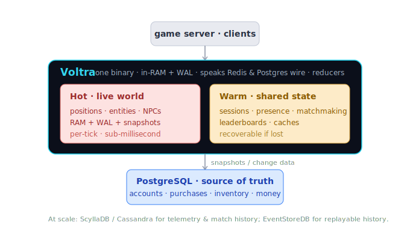

# Where Voltra fits

Most "which database for a multiplayer game?" advice gives you a flat list —
Postgres, Redis, Cassandra, Mongo, an event store. That list hides the only
question that actually decides the architecture:

> **How fast do you touch the data, vs how badly can you not lose it?**

Every store below is just a different point on that one axis.



## The three tiers

### Cold path — the source of truth
Accounts, purchases, inventory, friends, progression. Touched rarely per player,
but must survive forever and stay correct. Use a **relational database
(PostgreSQL)** — ACID, real queries, mature tooling. Non-negotiable for anything
involving money.

### Warm path — fast shared state
Sessions, presence, matchmaking queues, leaderboards, caches. Touched constantly,
but recoverable: if it vanishes, players reconnect. Use a **key-value store
(Redis / Valkey)**.

### Hot path — the live world
Positions, entities, NPCs, match state. Touched every tick, sub-millisecond,
per-player. No general-purpose database is fast enough — this lives **in RAM**,
made durable by an **append-only log + periodic snapshots**. This is the tier
studios historically build themselves.

### At very large scale
Two specialist cold-path stores appear: **wide-column (ScyllaDB / Cassandra)**
for billions of append-heavy rows (telemetry, match history), and **event stores
(EventStoreDB)** when you want full replayable history instead of current state.
Both trade query flexibility for write throughput.

## The classic hybrid — and its hidden cost

The textbook architecture wires the tiers together:

```
game server → RAM (live world) → append-only log → snapshots
                                         ↓
                          PostgreSQL (truth) + Redis (cache/presence)
```

It delivers low latency, durability, and scale — but you now **operate four
systems** and keep RAM and Postgres in sync yourself. That sync logic and the
operational burden are the real cost the flat list never mentions.

## What Voltra is

Voltra collapses the **hot + warm** tiers into one binary:

- **Hot path** — lock-free in-RAM tables + WAL + snapshots, built in.
- **Warm path** — speaks the **Redis** wire protocol natively (no separate Redis).
- **Cold-path compatibility** — speaks the **PostgreSQL** wire protocol, so existing
  tools and ORMs connect unchanged.
- **Reducers** (native Rust / JS / WASM) run game logic *inside* the data tier —
  no client → app-server → DB round-trips.

So Voltra is, in one line: **the hybrid architecture's RAM-layer + Redis + glue,
as a single process.**

It does *not* replace your Postgres for money and accounts — Voltra is honest
about being in-memory-first, and a real relational store remains the ultimate
source of truth. What Voltra removes is the bespoke RAM tier, the separate cache,
and the synchronization code you'd otherwise build and run yourself.

## Quick decision rule

| You need… | Use |
|---|---|
| Money, accounts, anything that must never be lost | PostgreSQL (source of truth) |
| Per-tick world/match state at sub-ms latency | Voltra (hot path) |
| Presence, matchmaking, leaderboards, cache | Voltra's Redis wire (warm path) |
| Billions of telemetry/history rows | ScyllaDB / Cassandra |
| Full replayable audit history | EventStoreDB |
